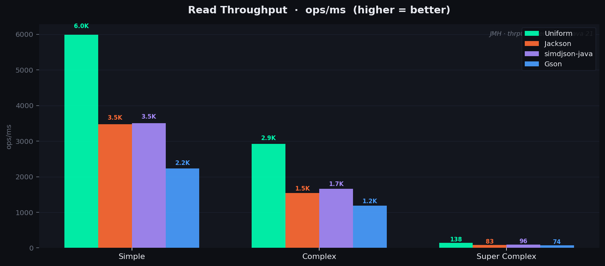
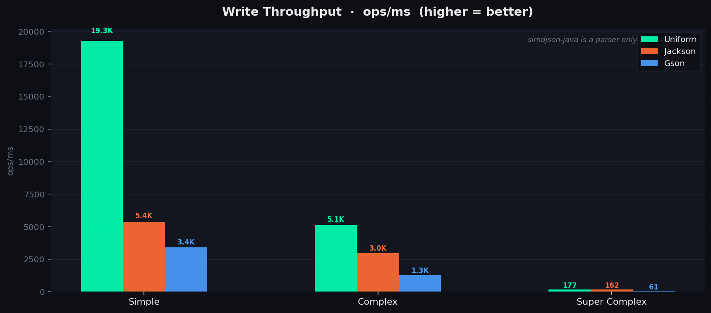
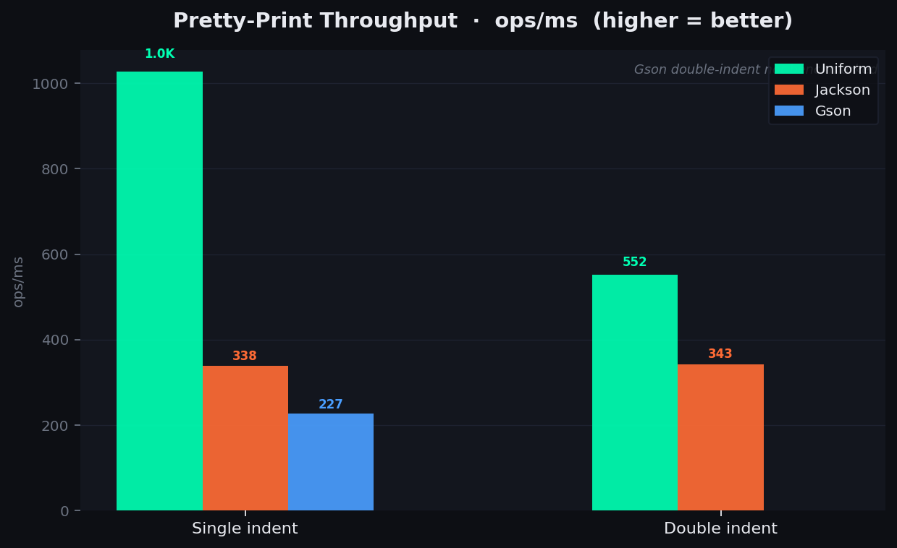
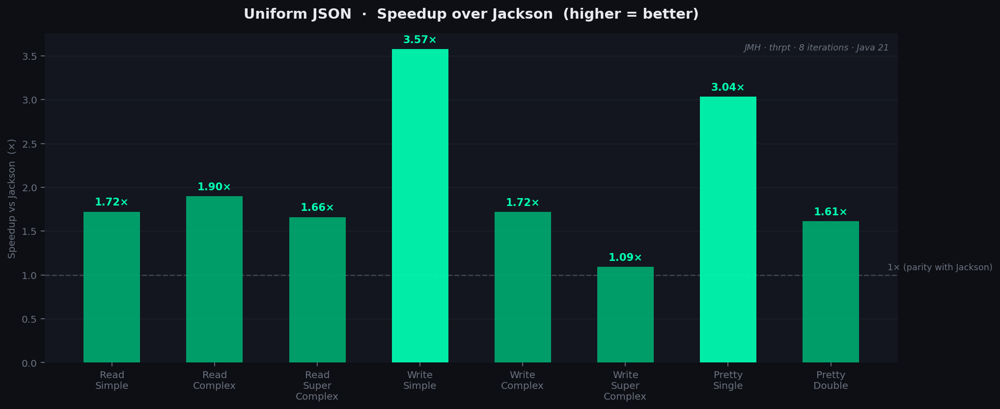

# Uniform JSON — Benchmarks

Benchmarks are run with [JMH](https://github.com/openjdk/jmh) in **Throughput** mode (`ops/ms`, higher is better).  
Environment: **Java 21**, 8 measurement iterations × 2 s, 3 warmup iterations, fork 1.  
SIMD path enabled via `--add-modules jdk.incubator.vector`.

Competitors:
| Library | Version | Role |
|---|---|---|
| **Uniform** | this repo | read + write + pretty-print |
| **Jackson Databind** | 3.0.3 | read + write + pretty-print |
| **Gson** | 2.11.0 | read + write + pretty-print |
| **simdjson-java** | 0.3.0 | read only (parser, no write path) |

> **Note:** [simdjson-java](https://github.com/simdjson/simdjson-java) is the official Java port of the simdjson C++ parser.  
> It has no serialization API — write benchmarks are Uniform / Jackson / Gson only.

---

## Read Throughput



| Payload | Uniform | Jackson | simdjson-java | Gson |
|---|---|---|---|---|
| Simple (~19 B) | **5,984** | 3,475 | 3,506 | 2,236 |
| Complex (~64 B) | **2,918** | 1,538 | 1,661 | 1,191 |
| Super Complex (~900 B) | **137.5** | 82.9 | 95.9 | 74.2 |

Uniform leads on every payload size. At small payloads simdjson-java's SIMD tape allocation overhead makes it slower than Uniform despite being a pure parser. The gap narrows at larger payloads as SIMD bulk-scanning starts to amortise.

---

## Write Throughput



| Payload | Uniform | Jackson | Gson |
|---|---|---|---|
| Simple (~19 B) | **19,268** | 5,390 | 3,410 |
| Complex (~64 B) | **5,111** | 2,971 | 1,286 |
| Super Complex (~900 B) | **177.4** | 162.5 | 60.9 |

The write story is Uniform's strongest result. **3.57× faster than Jackson** on simple payloads — driven by `ThreadLocal` `StringBuilder` reuse and a fast-path string escaping loop that avoids per-call stream allocation. The gap compresses at super-complex size as actual serialization work dominates over setup overhead.

---

## Pretty-Print Throughput



| Variant | Uniform | Jackson | Gson |
|---|---|---|---|
| Single indent (2 sp) | **1,027** | 338 | 227 |
| Double indent (4 sp) | **552** | 343 | — |

**~3× faster than Jackson** on pretty-printing, powered by a SIMD-precomputed quote mask that makes string boundary detection essentially free in `JsonStreamEngine`.

---

## Speedup vs Jackson



| Category | Speedup |
|---|---|
| Read Simple | 1.72× |
| Read Complex | 1.90× |
| Read Super Complex | 1.66× |
| Write Simple | **3.57×** |
| Write Complex | 1.72× |
| Write Super Complex | 1.09× |
| Pretty Single | **3.04×** |
| Pretty Double | 1.61× |

---

## Payload Definitions

<details>
<summary>Simple</summary>

```json
{"id":1,"name":"a"}
```
</details>

<details>
<summary>Complex</summary>

```json
{"id":1,"name":"a","child":{"id":2,"name":"b"},"count":42}
```
</details>

<details>
<summary>Super Complex (~900 B)</summary>

A deeply nested object with an address, 4 tags, 4 friends, metadata, and 3 orders each containing multiple line items. Generated programmatically in the benchmark setup.
</details>

---

## How to run

```bash
./gradlew :json:jmh
```

Results are written to `json/build/results/jmh/results.json`.

To run only the read/write benchmark:
```bash
./gradlew :json:jmh --tests "me.flame.uniform.json.bench.JacksonVsUniformReadWriteBenchmark"
```

To run only pretty-print:
```bash
./gradlew :json:jmhPrettyPrint
```
